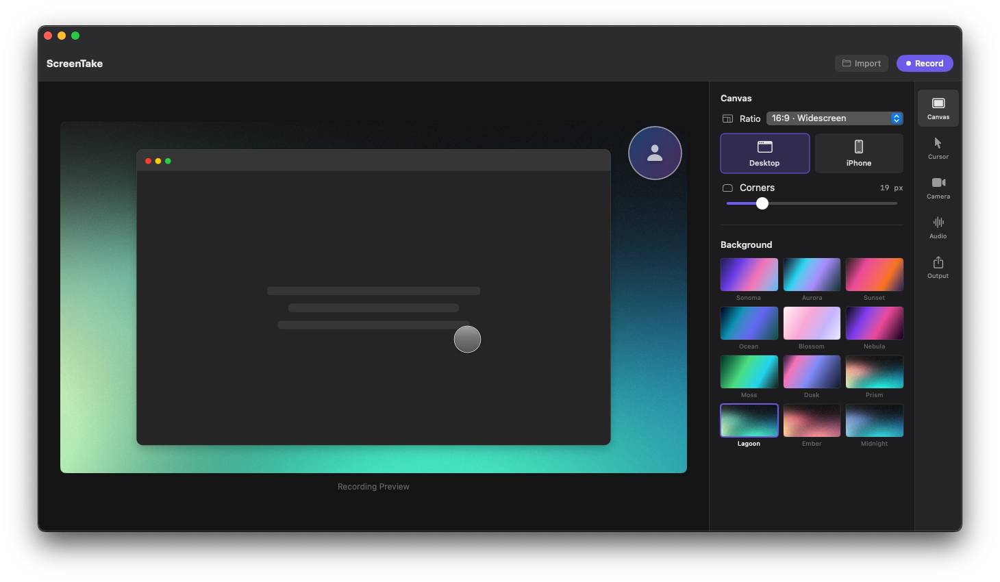

# screen-recorder-mac

Download **Screen**, a screen recording app for macOS.

This is the download-only repository for Screen. It contains installation instructions and packaged app releases, not the app's source code or development project. The installed app is named **Screen**.

## What It Can Do

Use Screen to record app demos, walkthroughs, tutorials, and presentations on your Mac.

- **Record your screen** with a choice of 30 or 60 FPS.
- **Capture audio** from your microphone, your Mac's system audio, or both.
- **Add a webcam overlay** with adjustable size and corner placement.
- **Make your cursor easier to follow** with cursor visibility, size controls, and click highlights.
- **Preview videos** inside the app, including recordings and imported video files.
- **Save recordings as MOV files** to share or use in your preferred video editor.

This is a test build. Recording behavior can vary by device and macOS version; make a short test recording before capturing anything important.

## Requirements

- An Apple Silicon Mac (M1 or newer). This build does not support Intel Macs.
- macOS 13 Ventura or later.

## Download and Install

1. Open the **Releases** section of this repository.
2. Download the **Screen-share-....zip** file under **Assets**, not GitHub's automatically generated source code archives.
3. Double-click the ZIP to extract **Screen.app**.
4. Move **Screen.app** to your **Applications** folder and open it.

## macOS Security Warning

This is a development build shared for testing. It is not notarized by Apple, so macOS may block it on first launch.

Only proceed if you trust the person who shared this app:

1. Try opening **Screen** once.
2. Open **System Settings > Privacy & Security**.
3. Find the message about Screen and click **Open Anyway**, if available.
4. Confirm the macOS prompt.

Do not disable macOS security protections. If no override is available or the app still will not open, report the exact message to the person who shared it.

## Permissions

Allow **Screen Recording** when prompted. On newer macOS versions, this setting may be called **Screen & System Audio Recording**.

Microphone and camera features also require **Microphone** and **Camera** access. You can manage these permissions in **System Settings > Privacy & Security**. Quit and reopen Screen if macOS asks you to.

## Updates and Feedback

To update, quit Screen, download a newer release, and replace the app in Applications.

Report problems through this repository's **Issues** section. Include your macOS version, Mac model, release version, and what happened. Remove private information from screenshots and recordings before sharing them.